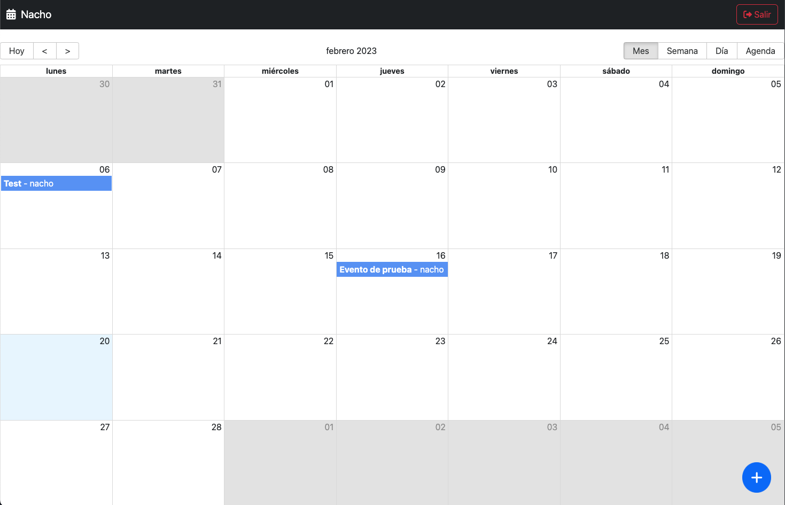
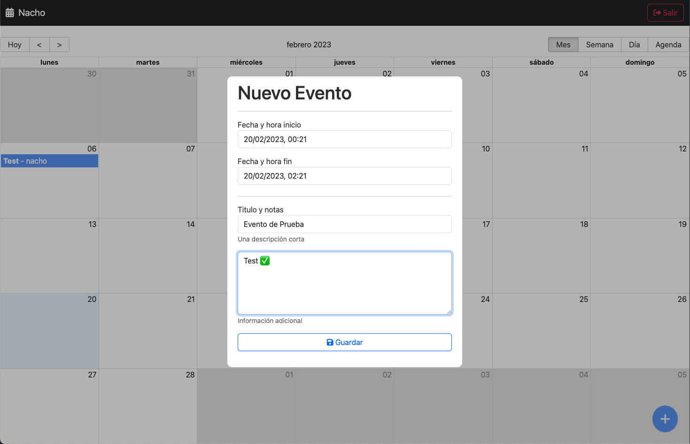
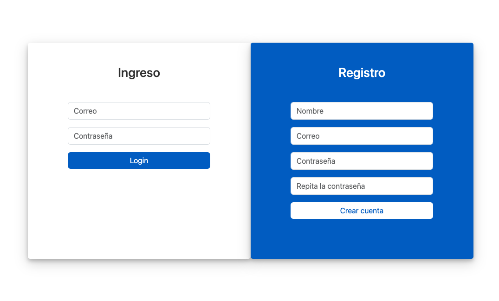

# MERN Calendar

Proyecto Final del curso de React de Fernando Herrera. Aplicación de Calendario en el stack MERN.

El frontend está desplegado en **gh-pages**: [**MERN Calendar Frontend**](https://juanignaciobogado.github.io/mern-calendar-frontend)

El [backend](https://github.com/JuanIgnacioBogado/mern-calendar-backend) está desplegado en [**fly.io**](https://fly.io/): [**MERN Calendar Backend**](https://mern-calendar-backend.fly.dev/) (redirecciona al frontend)

## Screenshots
<table>
  <tr>
    <td></td>
    <td></td>
  </tr>
  <td></td>
</table>

## Para Levantar Localmente

```bash
# Backend
git clone https://github.com/JuanIgnacioBogado/mern-calendar-backend.git

cd mern-calendar-backend
pnpm install
pnpm dev

# FrontEnd
git clone https://github.com/JuanIgnacioBogado/mern-calendar-frontend.git

cd mern-calendar-frontend
pnpm install
pnpm dev
```
